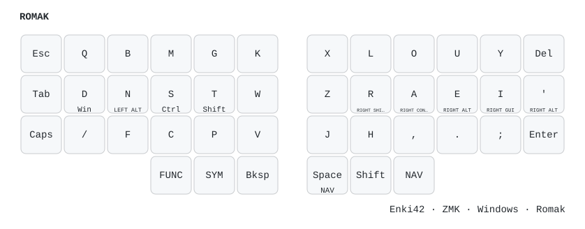
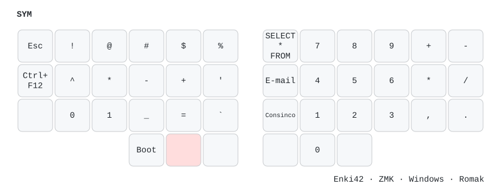
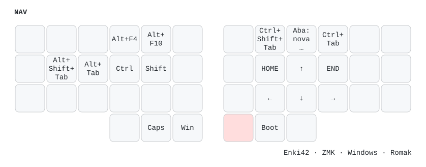
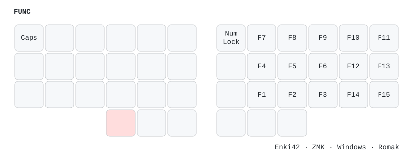

# Mapa visual do Enki42

Configuração: ZMK, Windows e layout Romak. As imagens abaixo são geradas a partir de `config/enki42.keymap`.

## Layers

### ROMAK

### SYM

### NAV

### FUNC

## Acesso e navegação

- Toque em `Space/NAV`: espaço.
- Segure `Space/NAV`: ativa `NAV`.
- A antiga tecla dedicada a `NAV` continua funcionando.
- Em `NAV`, `N` avança pelas janelas com `Alt+Tab` e `D` volta com `Alt+Shift+Tab`.
- As setas formam um T invertido central: `A` para cima e `H , .` para esquerda, baixo e direita.

## Combos

Todos os combos abaixo funcionam somente na layer `ROMAK`. `Bksp` é a tecla do polegar esquerdo. A tecla `Space` do polegar direito produz espaço ao tocar e ativa `NAV` ao segurar; a antiga tecla dedicada a `NAV` continua disponível.

### Edição e navegação

| Resultado | Pressione juntas |
|---|---|
| Copiar (`Ctrl+C`) | `M` + `N` + `Bksp` |
| Colar (`Ctrl+V`) | `M` + `T` + `Bksp` |
| Localizar (`Ctrl+F`) | `F` + `M` + `T` + `Bksp` |
| Tab | `M` + `G` + `Bksp` |
| Enter | `S` + `T` + `Bksp` |
| Desfazer (`Ctrl+Z`) | `F` + `C` + `Bksp` |
| Recortar (`Ctrl+X`) | `B` + `M` + `G` + `Bksp` |
| Selecionar tudo (`Ctrl+A`) | `B` + `Q` + `Bksp` |
| Shift+Enter | `N` + `S` + `T` + `Bksp` |

### Acentos e texto em português

| Resultado | Pressione juntas |
|---|---|
| `é` | `E` + `H` |
| `á` | `H` + `A` |
| `í` | `H` + `I` |
| `ó` | `H` + `O` |
| `ú` | `H` + `U` |
| `ç` | `C` + `Bksp` |
| `ão` | `A` + `O` |
| `ã` | `A` + `R` |
| `ões` | `O` + `E` |
| `ê` | `E` + `A` |

### Pontuação e pares

| Resultado | Pressione juntas |
|---|---|
| Parênteses `( )` | `E` + `A` + `Space` |
| Colchetes `[ ]` | `O` + `U` + `Space` |
| Chaves `{ }` | `,` + `.` + `Space` |
| Aspas simples | `M` + `B` + `Bksp` |
| Aspas duplas | `Bksp` + `N` + `S` |
| Interrogação `?` | `D` + `N` + `Bksp` |
| Ponto e vírgula `;` | `I` + `E` |

Nos combos de pares e aspas, toque e hold podem executar variantes diferentes definidas pelos comportamentos ZMK.
